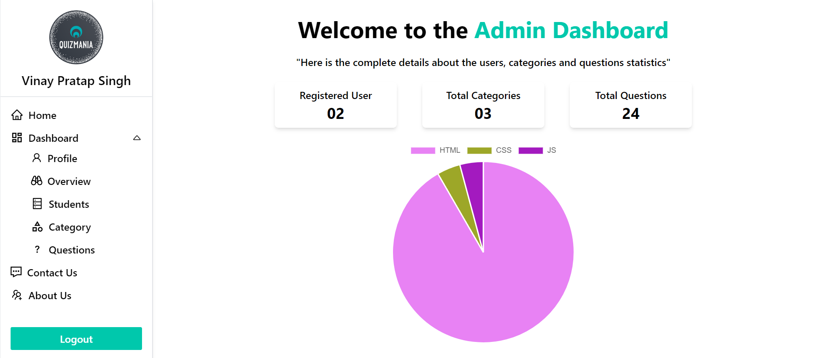

# **QuizMania**

QuizMania is a web application that provides users with quizzes to help them sharpen their technical skills. This app is intended for students and working professionals who wish to improve or review their skills in various technologies.

## **Table of Contents**

1. ### **[Features](#features)**
   - ### **[User Features](#features)**
   - ### **[Admin Features](#adminfeatures)**
2. ### **[Installation](#installation)**
3. ### **[Usage](#usage)**
4. ### **[Contributing](#contributing)**
5. ### **[Issues](#issues)**
6. ### **[License](#license)**
7. ### **[Links](#links)**
8. ### **[Output Sample](#sample)**

### **User Features **

- #### **User Accounts**

  Users can create their own account using either email and password or Google authentication. Once logged in, they can view their lifetime quiz results, including their passes, failures, and total attempts.

- #### **Quiz Categories**

  Users can select from a list of available quiz categories and take a quiz on their chosen topic. Each quiz consists of multiple choice questions with four possible answers.

- #### **Quiz Results**

  Once a user completes a quiz, they are presented with their score and whether they passed or failed.

- #### **Quiz Review**
  After completing a quiz, users can review their answers and see which questions they answered correctly and incorrectly. This allows them to learn from their mistakes and improve their knowledge in the chosen topic.

### **Admin Features **

- All the user feature is also available for the admin account

- #### **Admin Accounts**

  Admins can create their own account using either email and password or Google authentication. Admin can be made from database only, no one can create an account as admin directly. Once logged in, they have access to the admin panel where they can manage quiz categories, questions, and users.

- #### **Quiz Categories**

  Admins can create, update, and delete quiz categories. This allows them to offer a wide variety of topics for users to choose from, including popular tech stacks like JavaScript, ReactJs, and NodeJS.

- #### **Quiz Questions**

  Admins can create, update, and delete quiz questions for each category. This allows them to keep the quizzes fresh and up-to-date, ensuring that users are being tested on the most relevant skills and concepts.

- #### **User Management**

  Admins can view a list of all registered users and their quiz results.

- #### **Data Visualization**
  Admins can view graphs and charts of quiz results, providing insights into user performance and identifying areas where users may need more help or support.

### **Installation **

To use the app, you will need to have Yarn installed on your machine. Follow these steps:

- Clone the repository using git clone `https://github.com/Vinay-Pratap-Singh/QuizMania.git`
- Navigate to the project root directory using `cd QuizMania`
- Run `yarn install` to install the required dependencies
- Rename `.env.example` to `.env` and provide the required values

### **Usage **

Once you have installed the app, follow these steps to use it:

- Run `yarn start` to start the development server
- Open your web browser and navigate to `http://localhost:3000`
- Create an account or log in with Google
- Choose a quiz to attend from the list of available categories
- Answer the questions and submit your answers
- View your results and statistics on your result page

### **Contributing **

Contributions to QuizMania are welcome! To contribute:

- Fork the repository
- Create a new branch for your feature or bug fix
- Make your changes and commit them to your branch
- Push your branch to your forked repository
- Create a pull request
- All pull requests will be reviewed and merged if they are considered to be an improvement to the project.

### **Issues **

If you encounter any issues while using QuizMania, please open an issue on the GitHub repository with a detailed description of the problem.

### **License **

QuizMania is licensed under the **MIT License**.

### **Links **

[Deployed App](https://quizmania-harvi.netlify.app/)

[GitHub Repository](https://github.com/Vinay-Pratap-Singh/QuizMania)

### **Output Sample **

- #### **Homepage**

  

- #### **Admin Dashboard**
  
